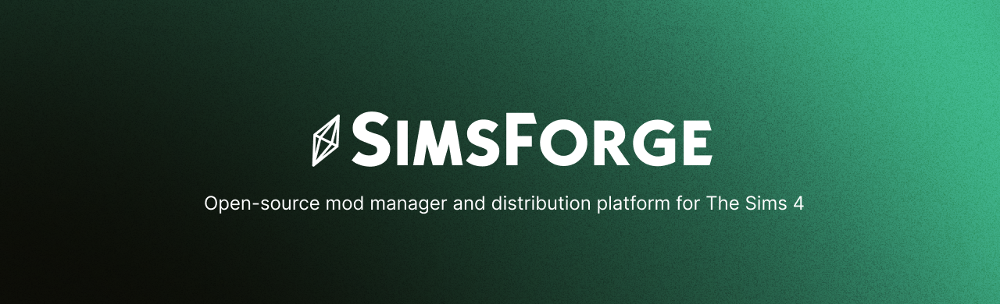

# Contributing to SimsForge

Thank you for your interest in contributing to SimsForge! This document provides guidelines and instructions for contributing to the project.

## Code of Conduct

We are committed to providing a welcoming and inclusive environment for all contributors. Please be respectful and constructive in all interactions.

## Getting Started

### Prerequisites

- **Node.js**: 18.0.0 or higher
- **npm**: 9.0.0 or higher
- **PostgreSQL**: 12+ (for backend development)
- **Git**: For version control

### Setup Development Environment

1. **Fork the repository** on GitHub
2. **Clone your fork**:
   ```bash
   git clone https://github.com/YOUR_USERNAME/simsforge.git
   cd simsforge
   ```

3. **Add upstream remote**:
   ```bash
   git remote add upstream https://github.com/Teyk0o/simsforge.git
   ```

4. **Install dependencies**:
   ```bash
   # Frontend
   cd app && npm install && cd ..

   # Backend
   cd backend && npm install && cd ..
   ```

5. **Configure environment variables**:
   - Copy `.env.example` to `.env.local` in each package
   - Fill in required values (see README for details)

6. **Start development servers**:
   ```bash
   # Terminal 1: Backend
   cd backend && npm run dev

   # Terminal 2: Frontend
   cd app && npm run tauri dev
   ```

## Branching Strategy

### Branch Naming Convention

Follow **Conventional Branch Names**:

```
<type>/<scope>/<short-description>
```

**Types**:
- `feat/` - New feature
- `fix/` - Bug fix
- `docs/` - Documentation
- `refactor/` - Code refactoring
- `test/` - Test additions/changes
- `perf/` - Performance improvements
- `chore/` - Build/dependencies/tooling
- `ci/` - CI/CD changes

**Examples**:
- `feat/mod-search-filters`
- `fix/auth-token-expiry`
- `docs/api-endpoints`
- `perf/optimize-mod-list`
- `test/add-auth-tests`

### Workflow

1. **Create a new branch** from `main`:
   ```bash
   git checkout -b feat/your-feature-name
   ```

2. **Keep your branch up to date**:
   ```bash
   git fetch upstream
   git rebase upstream/main
   ```

## Making Changes

### Code Style

#### English Only

All code, comments, documentation, and commit messages must be in **English**.

#### TypeScript

- Enable **strict mode** (already configured)
- Use meaningful variable names
- Add type annotations where not obvious
- Leverage TypeScript's type system

#### Formatting & Linting

```bash
# Backend
cd backend
npm run lint      # Run ESLint
npm run format    # Run Prettier

# Frontend
cd app
npm run lint      # Run ESLint
npm run format    # Run Prettier
```

**Before submitting a PR**, ensure:
- ✅ Code passes linting: `npm run lint`
- ✅ Code is formatted: `npm run format`
- ✅ No TypeScript errors: `npm run type-check`

### Documentation

All functions, classes, and modules should be documented:

**TypeScript/JavaScript**:
```typescript
/**
 * Fetches a list of mods with optional filtering.
 * @param options - Filter options for mod search
 * @param options.category - Filter by category ID
 * @param options.search - Search term for mod name/description
 * @returns Promise resolving to array of mods
 * @throws {Error} If API request fails
 */
async function fetchMods(options?: FetchModsOptions): Promise<Mod[]> {
  // implementation
}
```

**Comments should explain WHY, not WHAT**:
```typescript
// Good
// Debounce search to reduce API calls while user is typing
const debouncedSearch = useCallback(
  debounce((query: string) => fetchMods(query), 300),
  []
);

// Avoid
// Create a debounced function
const debouncedSearch = debounce((query: string) => fetchMods(query), 300);
```

## Testing

### Writing Tests

Tests are **required** for:
- ✅ New features
- ✅ Bug fixes
- ✅ Backend services
- ✅ API endpoints

**Backend Tests** (Jest):
```typescript
describe('AuthService', () => {
  describe('generateToken', () => {
    it('should generate a valid JWT token', () => {
      const token = AuthService.generateToken({ userId: '123' });
      expect(token).toBeDefined();
      const decoded = jwt.verify(token, process.env.JWT_SECRET);
      expect(decoded.userId).toBe('123');
    });

    it('should throw error if payload is invalid', () => {
      expect(() => AuthService.generateToken(null)).toThrow();
    });
  });
});
```

### Running Tests

```bash
# Backend
cd backend

# Run all tests
npm run test

# Run specific test file
npm run test -- src/services/auth.test.ts

# Watch mode during development
npm run test:watch

# Generate coverage report
npm run test:coverage
```

### Coverage Requirements

- **Target**: 70% code coverage for backend
- **Critical paths**: 100% coverage for auth, payment, and data validation services
- View coverage: `npm run test:coverage`

## Committing Changes

### Conventional Commits

Follow the **Conventional Commits** specification:

```
<type>[optional scope]: <description>

[optional body]

[optional footer]
```

**Types**:
- `feat:` A new feature
- `fix:` A bug fix
- `docs:` Documentation only changes
- `style:` Changes that don't affect code meaning (formatting)
- `refactor:` Code change that neither fixes a bug nor adds a feature
- `perf:` Code change that improves performance
- `test:` Adding missing tests or correcting existing tests
- `chore:` Changes to build process, dependencies, or tooling

**Examples**:

```
feat(auth): add two-factor authentication via email

- Implement email OTP validation
- Add 2FA settings to user account
- Include 2FA status in JWT token claims

Closes #123
```

```
fix(mods): prevent duplicate mod entries in dashboard

Load existing mods before inserting to check for duplicates.

Fixes #456
```

```
docs: add API endpoint documentation for mod search
```

### Commit Best Practices

1. **Keep commits focused**: One logical change per commit
2. **Make commits atomic**: Code should be in a working state after each commit
3. **Write clear messages**: Explain the "why", not just the "what"
4. **Reference issues**: Use `Closes #123` or `Fixes #456` in commit footer
5. **Don't mix concerns**: Keep refactoring separate from feature additions

## Submitting a Pull Request

### Before Submitting

1. **Update your branch** with latest changes:
   ```bash
   git fetch upstream
   git rebase upstream/main
   ```

2. **Run all checks locally**:
   ```bash
   # Backend
   cd backend && npm run lint && npm run test && npm run format && cd ..

   # Frontend
   cd app && npm run lint && npm run format && cd ..
   ```

3. **Verify no new warnings**:
   - Check console output for warnings
   - Ensure TypeScript compilation succeeds

### Creating the PR

1. **Push your branch**:
   ```bash
   git push origin feat/your-feature-name
   ```

2. **Create a Pull Request** on GitHub:
   - Use the PR template provided (auto-filled)
   - Fill in all sections thoroughly
   - Link related issues using `Closes #123`

### PR Requirements

- ✅ **Descriptive title**: Follow Conventional Commits format
- ✅ **Clear description**: Explain what and why
- ✅ **Test plan**: Document how to test the changes
- ✅ **All tests passing**: GitHub Actions must succeed
- ✅ **Code review approval**: At least one approval required
- ✅ **Up to date**: Branch must be up to date with main
- ✅ **No merge conflicts**: Must be mergeable

### PR Guidelines

- Keep PRs focused and reasonably sized (< 400 lines if possible)
- Include relevant screenshots for UI changes
- Update documentation if needed
- Add tests for new functionality
- Reference related issues and PRs

## Code Review Process

### For Reviewers

- ✅ Check code style and formatting
- ✅ Verify tests are adequate and passing
- ✅ Review logic and potential edge cases
- ✅ Ensure documentation is clear
- ✅ Provide constructive feedback

### For Authors

- ✅ Respond to feedback promptly
- ✅ Make requested changes in new commits (don't force push)
- ✅ Re-request review after making changes
- ✅ Ask questions if feedback is unclear

## Release Process

Releases follow semantic versioning:

```
MAJOR.MINOR.PATCH
```

- **MAJOR**: Breaking changes
- **MINOR**: New features (backward compatible)
- **PATCH**: Bug fixes

Releases are managed by maintainers.

## Issues and Discussions

### Reporting Bugs

Use the **Bug Report** template:
1. Provide clear steps to reproduce
2. Include environment information
3. Attach error messages and logs
4. Add screenshots if applicable

### Requesting Features

Use the **Feature Request** template:
1. Explain the use case
2. Describe proposed solution
3. Consider alternative approaches
4. Reference the roadmap if applicable

### Questions

Use the **Question** template or start a **Discussion**.

## Documentation

### What to Document

- New API endpoints
- New features or configuration options
- Changes to existing behavior
- Installation or setup requirements

### Where to Document

- **README.md**: Overview and quick start
- **/docs/**: Technical specifications
- **Code comments**: Implementation details
- **Commit messages**: Reasoning behind changes

## Helpful Resources

- [Technical Documentation](/docs/technical_doc.md)
- [README](/README.md)
- [CurseForge API Wrapper](/sources/curseforge-api/README.md)
- [Conventional Commits](https://www.conventionalcommits.org/)
- [Git Flow](https://www.atlassian.com/git/tutorials/comparing-workflows/gitflow-workflow)

## Getting Help

1. **Check documentation** - README, `/docs/`, and existing issues
2. **Search issues** - Your question might already be answered
3. **Ask in Discussions** - For general questions
4. **Create an issue** - For bugs or feature requests
5. **Contact maintainers** - For specific concerns

## Recognition

Contributors are recognized for their efforts:
- Merged PRs are referenced in release notes
- Regular contributors are added to CONTRIBUTORS.md
- Significant contributions are highlighted

## Questions?

Feel free to open an issue or start a discussion if you have questions about contributing.

---

Thank you for contributing to SimsForge! Your help makes this project better. 🎉
